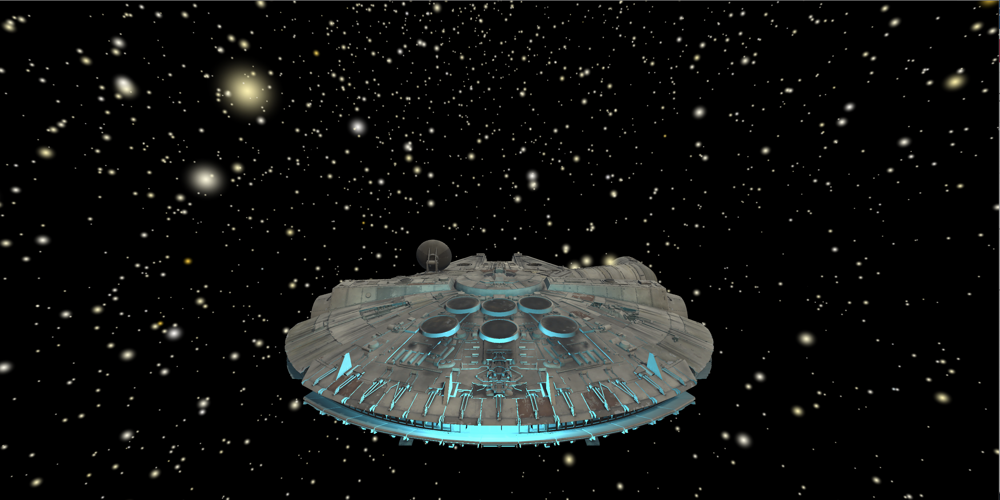
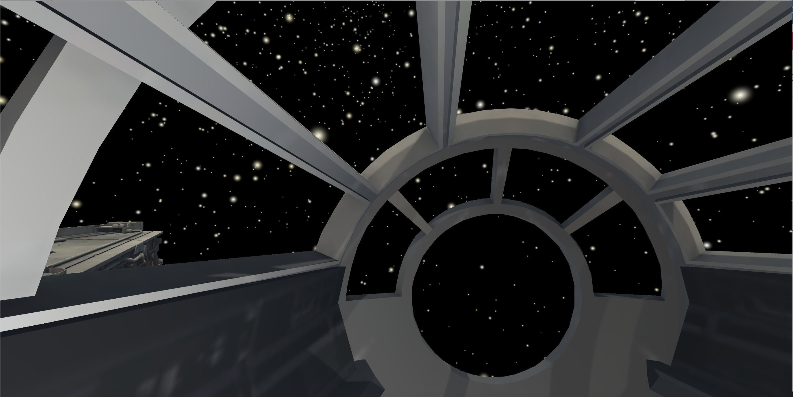

# Space Fly-Through

## Model
The model for the millenium falcon can be found https://sketchfab.com/3d-models/millennium-falcon-6a27ba566af142708743ccb8b4668d4b

	All credit for the model goes to Stym on Sketchfab.  Thank you!

Placing the resulting folder in Assets/Assets/ should be enough to get the unity envirornment working.  Then compilation can occur normally.

## Relevant Scripts
There is a control script that handes all interaction with keyboard/peripherals.  VR configurations is a work in progress.

The other important script is that of ParticleCSV which parses a csv and plots stars.

## Action Items
- Virtual Reality Support for Oculus Quest
- Tilting of Spacecraft
- Fine tuning of Flying

## Example Images

Here is an image of the main camera

Here is an image of the cockpit view
